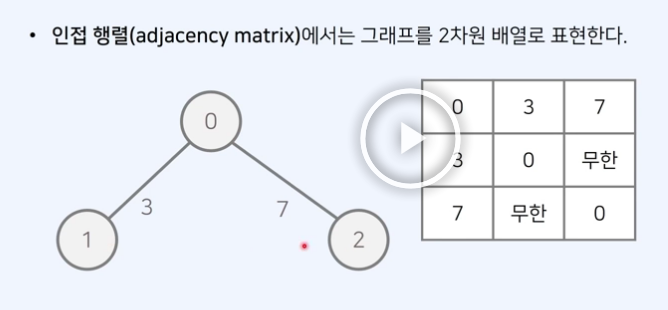
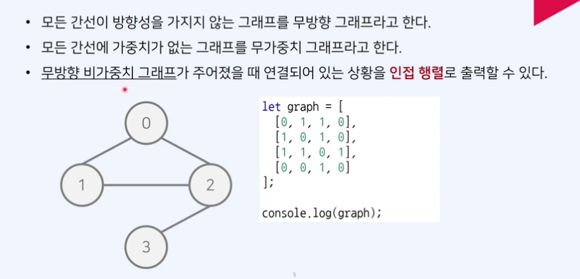

# 그래프

 

그래프

그래프란 사물을 정점과 간선으로 나타내기 위한 도구다.
그래프는 두 가지 방식으로 구현할 수 있다.

1. 인접 행렬 : 2차원 배열을 사용하는 방식
2. 인접 리스트 : 연결 리스트를 이용하는 방식

인접 행렬에서는 그래프를 2차원 배열로 표현한다.

각각의 노드가 다른 노드로 이동할 때의 비용을 표현하는 것이 인접 행렬이다.

<!--  -->

인접 행렬 - 무방향 무가중치 그래프

<!--  -->

인접 행렬 - 방향 가중치 그래프

- 무방향 무가중치 그래프와 완전 반대로 표시한 그래프다.

 

인접 행렬 vs 인접 리스트

최단 경로 알고리즘을 구현할 때, 어떤 자료구조가 유용할까?
각각 근처의 노드와 연결되어 있는 경우가 많으므로, 간선 개수가 적어 인접 리스트가 유리하다.
